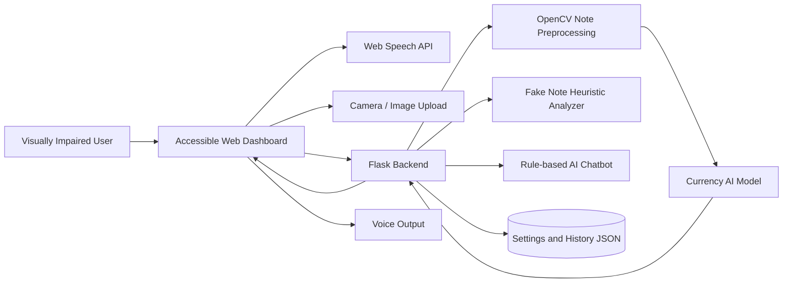
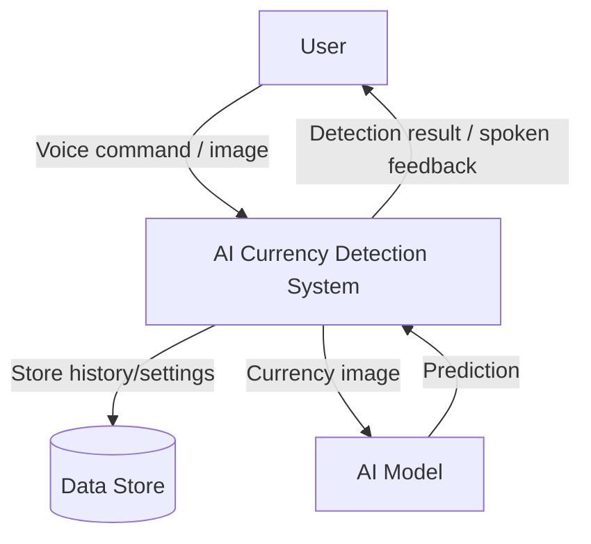
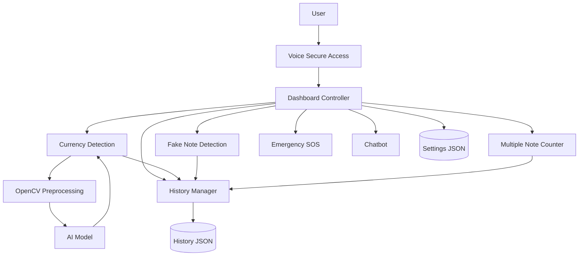
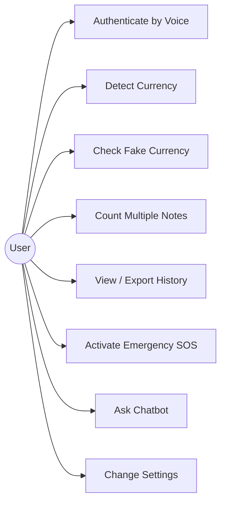
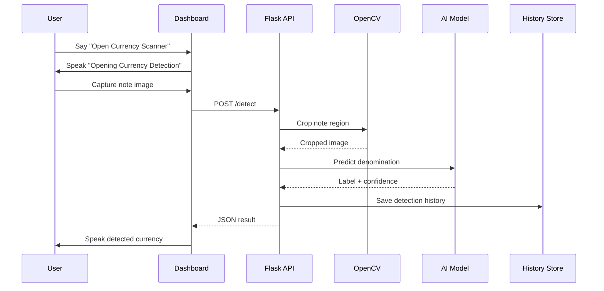
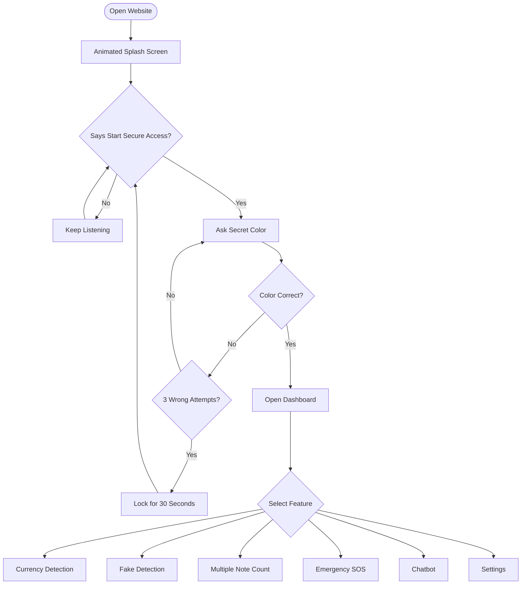
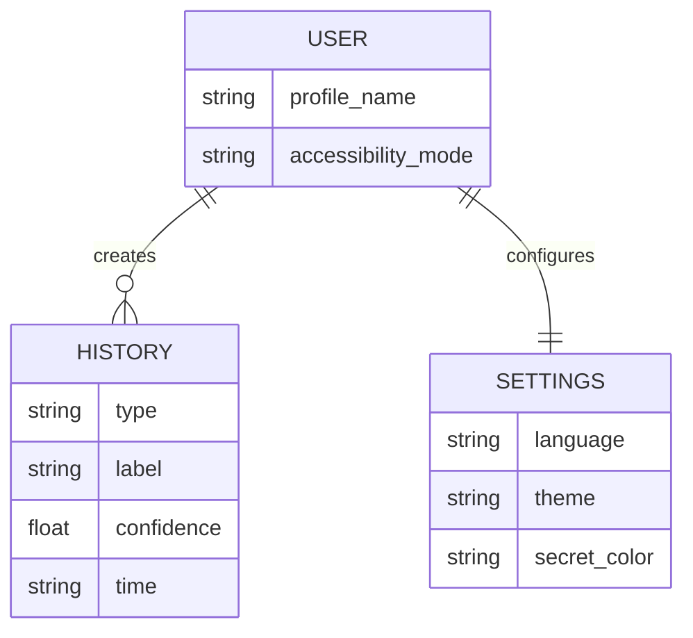

# System Diagrams

These diagrams use Mermaid syntax. They can be pasted into Mermaid Live Editor, GitHub Markdown, or supported documentation tools.

## Architecture Diagram

## DFD Level 0

## DFD Level 1

## Use Case Diagram

## Sequence Diagram

## Flowchart

## ER Diagram

